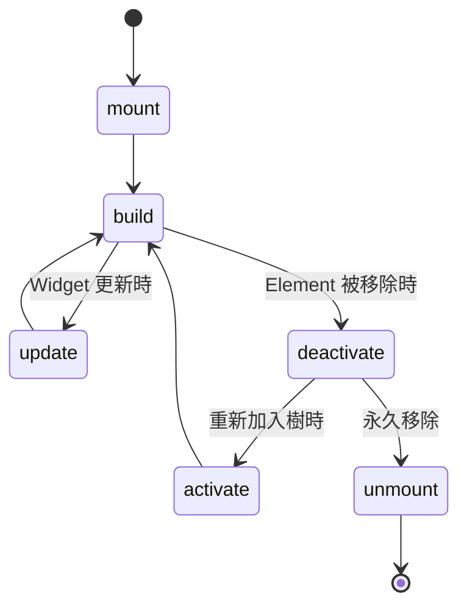
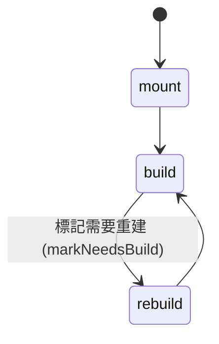
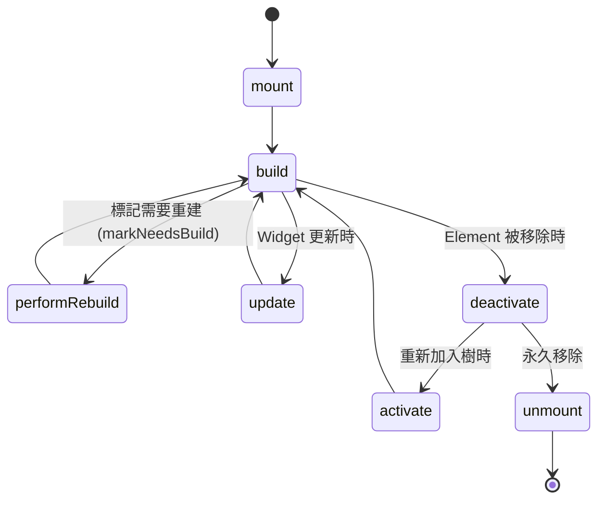

`Element` 是真正存在於 Widget Tree 上的“實體”，負責把 `Widget` 轉換成可顯示和能與其他部分互動的節點。

### Element 類別

```dart
/// Source: https://github.com/flutter/flutter/blob/d81baabfec4c49c9fcf96a05187f82604891f055/packages/flutter/lib/src/widgets/framework.dart#L3507-L5551
abstract class Element extends DiagnosticableTree implements BuildContext {
  Element(Widget widget);

  Widget get widget;

  Element? get _parent;
  RenderObject? get renderObject;

  Owner? owner;

  bool _active = false;
  int _depth = 0;

  @mustCallSuper
  void mount(Element? parent, Object? newSlot) { ... }

  @mustCallSuper
  void update(covariant Widget newWidget) { ... }

  @protected
  void performRebuild();

  void rebuild() { ... }

  @mustCallSuper
  void deactivate();

  @mustCallSuper
  void unmount() { ... }

  void activate() { ... }

  InheritedElement? dependOnInheritedElement(InheritedElement ancestor) { ... }

  void markNeedsBuild() { ... }

  RenderObject? findRenderObject();

  void visitChildren(ElementVisitor visitor);

  ...
}
```

#### Element 特性

- **抽象類別**
  - `Element` 是 `abstract class`，即「抽象類別」，不能直接 new 出來用，只能繼承。所有具體的 Element（如 `StatelessElement`、`StatefulElement`）都繼承自它。

- **可變（Mutable）**
  - 與 `Widget` 的不可變不同，`Element` 是可變的，可以在生命週期中更新其狀態和屬性。
  - 這設計讓 `Element` 能像「執行體」一樣負責實際的狀態管理、事件處理和渲染配置。

- **實現 BuildContext 接口**
  - 每一個 `Element`（`StatelessElement`、`StatefulElement`、`RenderObjectElement` 等）都是一個 `BuildContext`。
  - 當框架呼叫你的 `build(BuildContext context)` 時，傳進來的 `context` 參數，其實際物件就是這個 `Widget` 對應的 `Element`。

- **生命週期管理**
  - `Element` 有完整的生命週期方法：`mount`（掛載）、`update`（更新）、`rebuild`（重建）、`deactivate`（停用）、`unmount`（卸載）和 `activate`（激活）。
  - 這些方法確保 `Element` 在 Widget Tree 中的變化時能正確處理資源分配和釋放。

- **連接 Widget 和 RenderObject**
  - `Element` 持有對應的 `Widget` 和 `RenderObject`，負責將 Widget 的描述轉換成可渲染的對象。
  - 通過 `findRenderObject()` 方法，可以訪問底層的渲染樹節點。

- **依賴管理**
  - `dependOnInheritedElement` 方法允許子 Element 依賴祖先的 `InheritedElement`，實現數據共享和通知機制。
  - `markNeedsBuild` 用於標記需要重建，觸發 Flutter 的重建流程。

#### Element 生命週期流程圖




### StatelessElement 類別

```dart
/// Source: https://github.com/flutter/flutter/blob/d81baabfec4c49c9fcf96a05187f82604891f055/packages/flutter/lib/src/widgets/framework.dart#L5883-L5897
class StatelessElement extends ComponentElement {
  StatelessElement(StatelessWidget super.widget);

  @override
  Widget build() => (widget as StatelessWidget).build(this);

  @override
  void update(StatelessWidget newWidget) {
    super.update(newWidget);
    assert(widget == newWidget);
    rebuild(force: true);
  }
}
```

#### StatelessElement 特性

- **無內部可變狀態**
  - 不像 `StatefulElement` 持有獨立的 `State` 物件，`StatelessElement` 直接持有 `StatelessWidget` 作為配置。
  - 這意味著 `StatelessElement` 不管理任何內部狀態，所有行為都由其對應的 `Widget` 決定。

- **重建成本極低**
  - 因為沒有額外狀態，重建時只需執行 `widget.build()` 並更新子樹。
  - 這種設計使得 `StatelessElement` 在重建過程中非常高效，適合用於靜態或簡單的 UI 組件。

#### StatelessElement 掛載流程圖



### StatefulElement 類別

```dart
/// Source: https://github.com/flutter/flutter/blob/d81baabfec4c49c9fcf96a05187f82604891f055/packages/flutter/lib/src/widgets/framework.dart#L5899-L6132
class StatefulElement extends ComponentElement {
  StatefulElement(StatefulWidget widget) : _state = widget.createState(), super(widget) { ... }

  State<StatefulWidget> get state => _state!;
  State<StatefulWidget>? _state;

  @override
  Widget build() => state.build(this);

  @override
  void reassemble() { ... }

  @override
  void performRebuild() { ... }

  @override
  void update(StatefulWidget newWidget) { ... }

  @override
  void activate() { ... }

  @override
  void deactivate() { ... }

  @override
  void unmount() { ... }

  @override
  InheritedWidget dependOnInheritedElement(Element ancestor, {Object? aspect}) { ... }

  @override
  void didChangeDependencies() { ... }
}
```

#### StatefulElement 特性

- **持有兩個物件**
  - `StatefulElement` 同時管理 `StatefulWidget`（不可變配置）和 `State` 物件（可變狀態）。

- **State 生命週期管理**
  - `State` 的整個生命週期（`initState`、`didUpdateWidget`、`dispose` 等）由 `StatefulElement` 負責調用。
  - 這確保狀態在 Widget Tree 變化時正確初始化、更新和清理。

- **重建成本稍高**
  - 每次重建時呼叫 `state.build()`，並處理狀態變化。
  - 相比 `StatelessElement`，多出狀態管理的開銷，但支援動態更新。

- **支援 GlobalKey 移植**
  - 當帶 `GlobalKey` 的 `StatefulWidget` 在樹中移動時，`StatefulElement` 會保留同一組（widget + state），避免狀態丟失。

- **關鍵生命週期方法**
  - `mount()`：建立 `State` 物件並初始化。
  - `update()`：更新 widget 並呼叫 `didUpdateWidget`。
  - `performRebuild()`：呼叫 `state.build()` 並更新子樹。
  - `deactivate()` 和 `unmount()`：處理暫時移除和永久銷毀，呼叫 `dispose`。

#### StatefulElement 掛載流程圖



