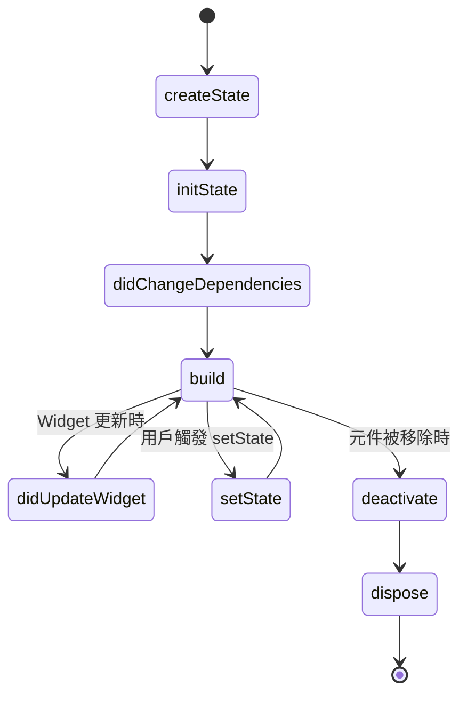

`StatefulWidget` 是一種擁有可變狀態（mutable state）的 `Widget`，能夠根據用戶交互或其他事件動態更新 UI。

### StatefulWidget 類別

`StatefulWidget` 繼承自 `Widget`，是 Flutter 框架中用於創建動態 UI 組件的基础類別。

```dart
/// Source: https://github.com/flutter/flutter/blob/4de6fcc369e7619e216f29cb66aa53338a18de1d/packages/flutter/lib/src/widgets/framework.dart#L575-L801
abstract class StatefulWidget extends Widget {
  const StatefulWidget({super.key});

  @override
  StatefulElement createElement() => StatefulElement(this);

  @protected
  @factory
  State<StatefulWidget> createState();
}
```

#### StatefulWidget 特性

- **抽象類別**
  - `StatefulWidget` 是抽象類別，不能直接實例化，必須通過繼承來使用。
  - 所有需要維護狀態的 UI 組件都應該繼承自 `StatefulWidget`。

- **可變狀態**
  - 與 `StatelessWidget` 不同，`StatefulWidget` 可以維護內部狀態，並通過 `State` 物件來管理這些狀態。
  - 狀態變化時，可以調用 `State` 的 `setState()` 方法來觸發 UI 重建。

- **createState() 方法**
  - 必須實現 `createState()` 方法，返回一個 `State` 實體。
  - `State` 類別負責管理 `StatefulWidget` 的狀態和生命週期。


### State 類別

一個 `StatefulWidget` 類別會對應一個 `State` 類別。

```dart
/// Source: https://github.com/flutter/flutter/blob/4de6fcc369e7619e216f29cb66aa53338a18de1d/packages/flutter/lib/src/widgets/framework.dart#L825-L1534
abstract class State<T extends StatefulWidget> with Diagnosticable {
  T get widget;
  BuildContext get context;
  bool get mounted;

  @protected
  @mustCallSuper
  void initState();

  @protected
  @mustCallSuper
  void didUpdateWidget(covariant T oldWidget);

  @protected
  @mustCallSuper
  void setState(VoidCallback fn);

  @protected
  @mustCallSuper
  void dispose();

  @protected
  Widget build(BuildContext context);

  @protected
  @mustCallSuper
  void didChangeDependencies();
}
```

#### State 特性

- **抽象類別**
  - `State` 是抽象類別，與 `StatefulWidget` 配對使用，負責管理狀態和 UI 描述。
  - 泛型參數 `T` 必須是 `StatefulWidget` 的子類別。

- **屬性**
  - `widget`：當前 `StatefulWidget` 實體，可以存取 `StatefulWidget` 傳進來的配置參數。由於 `StatefulWidget` 本身是 `immutable`，當父 `Widget` 重建並提供新的配置時，框架會更新這個 `widget` 屬性，並呼叫 `didUpdateWidget()`。
  - `context`：`State` 在 Widget Tree 中的位置，與 `StatelessWidget` 的 `context` 功能完全相同。
  - `mounted`：檢查 `State` 是否仍在樹中，用來避免在 `State` 銷毀後操作。在 `dispose()` 被呼叫後會變成 `false`。

- **生命週期方法**
  - `initState()`：`State` 剛建立完成、與 `BuildContext` 關聯後，只呼叫一次。主要用於一次性的初始化 (在呼叫 `super.initState()` 後)：讀取數據、建立 `Controller`、訂閱 `Stream`。
  - `didChangeDependencies()`：在 `initState()` 之後立即呼叫一次。之後只要依賴的 `InheritedWidget` 改變（例如 `Theme、Locale、Provider` 值改變），或 `Widget` 在樹中移動，就會再次呼叫。
  - `didUpdateWidget()`：當父 `Widget` 重建，並傳入相同 `runtimeType` 與 `key` 但配置不同時呼叫。用於回應 `Widget` 配置（widget.xxx）改變，例如啟動新動畫、重新計算。
  - `setState()`：手動呼叫，用於更新狀態並觸發 UI 重建。
  - `build()`：每次需要描述 UI 時（`initState` 後、`setState` 後、父 `Widget` 重建後、`InheritedWidget` 改變後等）呼叫。
  - `deactivate()`: 是生命週期中的「中間站」：暫時移除或移動，但不一定銷毀。
  - `dispose()`：`State` 物件即將永久銷毀，`Widget` 從樹中移除時調用。用於釋放資源、取消訂閱、停止動畫 (在 `super.dispose()` 前)。

### StatefulWidget 生命週期流程圖




### StatefulElement 類別

```dart
/// Source: https://github.com/flutter/flutter/blob/d81baabfec4c49c9fcf96a05187f82604891f055/packages/flutter/lib/src/widgets/framework.dart#L5899-L6132
class StatefulElement extends ComponentElement {
  StatefulElement(StatefulWidget widget) : _state = widget.createState(), super(widget) { ... }

  State<StatefulWidget> get state => _state!;
  State<StatefulWidget>? _state;

  @override
  Widget build() => state.build(this);

  @override
  void reassemble() { ... }

  @override
  void performRebuild() { ... }

  @override
  void update(StatefulWidget newWidget) { ... }

  @override
  void activate() { ... }

  @override
  void deactivate() { ... }

  @override
  void unmount() { ... }

  @override
  InheritedWidget dependOnInheritedElement(Element ancestor, {Object? aspect}) { ... }

  @override
  void didChangeDependencies() { ... }
}
```

#### StatefulElement 特性

- **持有兩個物件**
  - `StatefulElement` 同時管理 `StatefulWidget`（不可變配置）和 `State` 物件（可變狀態）。

- **State 生命週期管理**
  - `State` 的整個生命週期（`initState`、`didUpdateWidget`、`dispose` 等）由 `StatefulElement` 負責調用。
  - 這確保狀態在 Widget Tree 變化時正確初始化、更新和清理。

- **重建成本稍高**
  - 每次重建時呼叫 `state.build()`，並處理狀態變化。
  - 相比 `StatelessElement`，多出狀態管理的開銷，但支援動態更新。

- **支援 GlobalKey 移植**
  - 當帶 `GlobalKey` 的 `StatefulWidget` 在樹中移動時，`StatefulElement` 會保留同一組（widget + state），避免狀態丟失。

- **關鍵生命週期方法**
  - `mount()`：建立 `State` 物件並初始化。
  - `update()`：更新 widget 並呼叫 `didUpdateWidget`。
  - `performRebuild()`：呼叫 `state.build()` 並更新子樹。
  - `deactivate()` 和 `unmount()`：處理暫時移除和永久銷毀，呼叫 `dispose`。